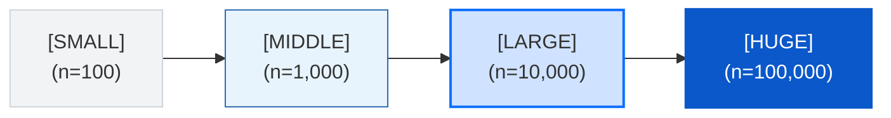

# @watervein/benchmark

The structural verification and stress-testing suite for the Watervein reactive ecosystem. This system measures deep dependency graphing, extreme fan-in/out propagation profiles, raw memory footprints via `performance.memory` tracking, and the microsecond overhead introduced by high-level DSL translations.

---

## Benchmark Philosophy

Watervein skips the Virtual DOM entirely and instead leverages a graph-driven Reactive Entity Component System (ECS). To ensure zero regression and track memory leak thresholds across scaling iterations, this benchmark targets three key areas:
1. **Graph Topologies**: Testing deeply nested reactive chains, wide fan-out broadcast trees, and massive dependency gathering structures (Fan-In).
2. **Reconciliation Cost**: Tracking DOM mutation cost during `For` array inversions and fractional state drops ($10\%$ vs $50\%$ row replacements).
3. **Abstraction Overhead**: Measuring the precise time cost in microseconds ($\mu s$) when translating high-level template properties down to raw core nodes.

---

## Key Metrics Captured

| Benchmark Identifier | Strategy & Target | Crucial Optimization Verified |
| :--- | :--- | :--- |
| **`[BUILD DAG]`** | Generates up to 100,000 computed dependency lanes. | Graph node allocation and tree balancing speeds. |
| **`[HIGH FREQUENCY UPDATE]`** | Thousands of atomic signals fired across buffered batch scopes. | Transient state deduction and layout collapse avoidance. |
| **`[DESTROY ENTITY]`** | Micro-benchmark comparing singular vs. multi-entity bulk flushes. | Garbage Collection alignment and ECS entity graph pruning efficiency. |
| **`[PARTIAL REPLACE]`** | Destroys and appends raw components mid-array. | List element retention and stable element caching efficiency. |
| **`[DOM Mapping Abstraction]`** | Compares `dom-core` primitive processing with `dom` wrappers. | Tracks the exact overhead (per-element in $\mu s$) of the developer-friendly DSL wrapper. |

---

## Setup & Running the Tests

To accurate evaluate heap changes (`Δheap`), execute these benchmarks in an environment supporting the global Chrome V8 Engine garbage collector flag (`--js-flags="--expose-gc"`).

### 1. Register Global Triggers
Import the test runner bundle inside your web runtime shell. The package registers two testing scopes directly on the window object:

```typescript
import '@watervein/benchmark'; 

// 1. Run the standardized isolation stress suite
window.runWaterveinBenchmark();

// 2. Run the exponential macro-scale sweep (SMALL -> HUGE)
window.runWaterveinScaleBenchmark();
```

## Multi-Scale Evaluation Levels
`runWaterveinScaleBenchmark()` iteratively sweeps across four distinct node load densities, ensuring framework reactivity scales linearly:


- `SMALL` & `MIDDLE`: Standard application view scopes. Focuses on base reaction overhead.
- `LARGE`: High-density interactive canvas data or heavy real-time data table streams.
- `HUGE` ($100,000$ Nodes): Absolute framework stress barrier. Measures system boundaries for raw node graph compilation speeds, extreme fan-out limits, and total heap memory impacts.

## Architectural Deep-Dive: Overhead Profiling
The framework isolates user-space abstractions by directly racing `el0` (low-level node builders) against `el1` (high-level DSL tag factories):
```mermaid
graph TD
    subgraph Methods [Benchmark Methods]
        direction TB
        MethodA["<strong>Method A (el0)</strong><br><code>el0(\"div\", { class: { \"box\": true } }, [ () => ... ])</code>"]
        MethodB["<strong>Method B (el1)</strong><br><code>el1(\"div\", { class: { \"box\": true } }, [ () => ... ])</code>"]
    end

    subgraph Analysis [Resulting Delta Execution Time]
        direction TB
        Formula["$$ \Delta\text{Time} = \frac{\text{Time}_{\text{el1}} - \text{Time}_{\text{el0}}}{\text{Total Elements}} $$"]
        Discovery["<strong>Discovers:</strong><br>The pure cost of 'isNode' checking and<br>dynamic class property parsing."]
    end

    Methods --> Analysis
    Formula --> Discovery

    style MethodA fill:#f8f9fa,stroke:#dee2e6,stroke-width:1px
    style MethodB fill:#f8f9fa,stroke:#dee2e6,stroke-width:1px
    style Formula fill:#e8f4fd,stroke:#2b6cb0,stroke-width:1px
    style Discovery fill:#fff3cd,stroke:#ffc107,stroke-width:1px
```

By profiling the framework this way, we ensure that the convenience of object-literal assignments and clean functional syntax never comes at the cost of high runtime rendering overhead.

## License
MIT License. Built to keep performance metrics transparent and lightning fast.