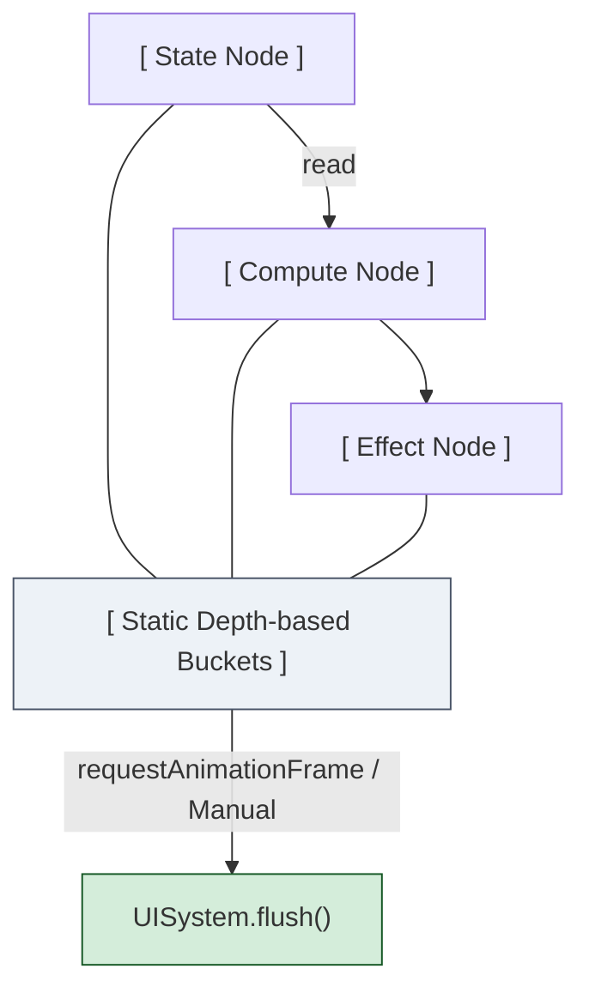

# @watervein/core

[](https://www.npmjs.com/package/@watervein/core)
[](LICENSE)

The core reactive engine powered by **NES (Node Edge System)** and **DAGs (Directed Acyclic Graphs)**. No Virtual DOM components, no traditional hierarchical trees. Just data nodes, edges, and flat graph propagation.

Designed specifically as the reactive core for the Watervein UI system.

---

## Key Features

- **Flat Graph Reactive Engine**: Pure DAG-based propagation that skips tree-traversal or component lifecycle overhead.
- **Topological Bucket Sorting**: Updates are grouped into static depth-buckets (`MAX_DEPTH = 1024`) to keep evaluation order glitch-free.
- **Dynamic Dependency Tracking**: Fine-grained, auto-cleaning reactive edges using dense flat arrays instead of `Set` or `Map` objects.
- **ECS-Inspired Entity System**: Group related reactive nodes inside "Entities". Destroy entire UI sub-graphs and free node IDs via pooled swap-removal operations.

---

## Installation

```bash
pnpm add @watervein/core
```

## Core API

`createState<T>(initial: T): Node<T>`
Creates a raw source state node.
```typescript
import { createState, write } from '@watervein/core';

const price = createState(100);
write(price, 120); // Schedules dependents for the next system flush
```

`createCompute<T>(fn: () => T): Node<T>`
Creates a memoized derivative node that dynamically tracks any other nodes accessed within `fn`.
```typescript
import { createState, createCompute, read } from '@watervein/core';

const quantity = createState(2);
const total = createCompute(() => read(price) * read(quantity));
```

`createEffect(fn: () => void): Node<void>`
Creates a side-effect node that re-runs whenever its tracked dependencies mutate, on the next flush.
```typescript
import { createEffect, read } from '@watervein/core';

createEffect(() => {
  console.log(`Current Total: ${read(total)}`);
});
```
`batch(fn: () => void)`
Groups multiple state modifications into a single transaction to prevent unnecessary intermediate evaluations.
```typescript
import { batch, write } from '@watervein/core';

batch(() => {
  write(price, 150);
  write(quantity, 5);
}); // Automatically calls flush() at the end of the batch
```

## Control Flow & Entity APIs
Watervein introduces low-level control flow structures that manage underlying memory nodes through transactional Entity scopes.

`mapEntity<T>(listNode: Node<T[]>, keyFn: (item: T) => any, renderFn: ...)`
A building block for keyed, entity-scoped iteration over a list. Generates reactive scopes bound to unique entity lifecycles based on key matches, and purges obsolete nodes on each pass. (Note: the higher-level `For` helper in `@watervein/dom-core` no longer builds on top of `mapEntity` directly — see that package's README for its current reconciliation strategy.)

`matchEntity(conditionNode: Node<boolean>, thenFn: () => void, elseFn?: () => void)`
Conditional structural rendering. Creates and discards internal reactive entity contexts on condition pivots.

## Advanced Architecture (Design Goals)



1. **Memory Compact Nodes**: Nodes use continuous flat array tracking (`subsDense` and `depsDense`) instead of nested `Set`/`Map` structures, reducing garbage-collection pressure during large-scale updates.

2. **Glitch-Free Propagation**: During a graph evaluation (`flush`), dirtied nodes are processed from `minDirtyDepth` to `maxDirtyDepth` using depth-indexed buckets. This is designed to prevent derivative computations from running against partial or stale inputs within a single flush pass.

3. **Double-Stamp Edge Commits**: Edge evaluation tracks version stamps (`edgeCommitVersion`) to diff active links inline, removing stale dependencies in a single sweep without allocating new array structures.

### A note on error handling

`flush()` does not currently isolate exceptions between nodes. If a `compute` or `effect` throws during a flush pass, the exception propagates out of `flush()`, and any remaining dirty nodes scheduled for that pass are left unprocessed until the next `write()` re-triggers them (if it does). There is no error-boundary mechanism at the core level yet. If your `compute`/`effect` callbacks can throw, wrap the risky part in your own `try/catch` for now.

## License
MIT License.